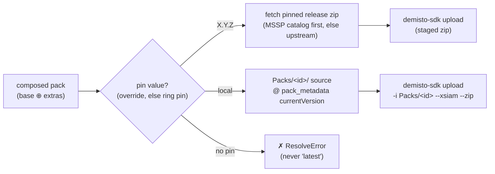
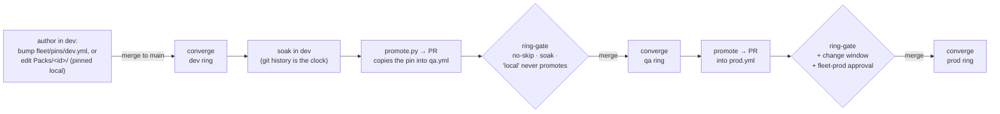
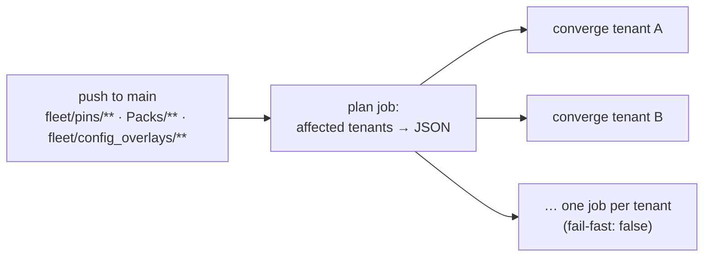

# XSIAM MSSP Fleet — control plane

The **Plane 2** layer an MSSP operates on top of the upstream
`Palo-Cortex/secops-framework` (Plane 1) to manage XSIAM content across many
customer tenants — with per-ring version pins, `demisto-sdk` as the only
transport, and customers able to layer their own content on the same tenants
without collisions.

This repo is a **template**: a complete, self-contained fleet repo with example
tenants, groups, pins, and one example MSSP-authored pack. Everything runs
offline out of the box (CI stays green with zero setup), and every example name
is a placeholder you replace with your own. Start with
[`docs/getting-started.md`](docs/getting-started.md) to adopt it; this README is
the operator's map, [`docs/runbook.md`](docs/runbook.md) covers day-to-day
tasks, and two lifecycle walkthroughs cover content end to end:
[`docs/custom-pack-lifecycle.md`](docs/custom-pack-lifecycle.md) for
MSSP-authored packs (author → package → qa → prod) and
[`docs/customer-pack-lifecycle.md`](docs/customer-pack-lifecycle.md) for
customer-owned packs (the second writer — referenced, protected, never
deployed by the fleet).

> One MSSP = one fleet repo like this. It **consumes** the upstream framework
> catalog by URL and fetches pinned release zips at deploy time — it never forks
> the framework.

---

## The model in one screen

**Composition** (which packs a tenant gets) is separate from **pins** (what
version, per ring):

```
composition  = base (defaults.yml) ⊕ extras (subscribed groups ∪ tenant extras)
pin(pack)    = tenant.pin_overrides[pack]  or  fleet/pins/<ring>.yml[pack]
effective    = every composed pack, resolved to its ring's pin
```

Because pins live per ring, the same pack can be at 2.7.22 in dev and 2.7.21
in qa/prod at once. **Promotion** is a PR that copies a pin forward
(dev → qa → prod); **convergence** is the merge-triggered run that makes a ring's
tenants match its pins. There is no separate deploy button.

Routing is **pin-driven**: the pin's *value* — not where the pack's source
lives — selects the deploy path. An exact version fetches the pinned release
zip via a catalog — the committed `mssp_pack_catalog.json` for MSSP-authored
packs, the upstream catalog for everything else. The sentinel `local` (dev-only)
deploys an **MSSP-authored pack** straight from this repo's `Packs/<id>/` source
at its `pack_metadata.json` `currentVersion`. A composed pack with no pin is a
hard error — the fleet never deploys "latest".



Two independent writers touch each tenant — this fleet and the customer's overlay
repo — kept apart by a purely structural **namespace prefix** contract, so no ID
inventory is ever exchanged.

| Pack class | Where | Owned by | Versioned / drift-checked |
|------------|-------|----------|---------------------------|
| **Base** | `defaults.yml › base` | MSSP | yes |
| **Extra** | `groups/*.yml › extras`, tenant `extras:` | MSSP | yes |
| **Custom** | tenant `custom:` (referenced only) | **customer** | never — must carry a registered prefix |

An **MSSP-authored pack** (source in `Packs/`) enters composition as base or
extra like any other pack — only its *pin value* differs: a released version
from the MSSP catalog (the normal, promotable form — `ExamplePack: 1.0.0` in
dev today), or the `local` sentinel as a dev-only fast path. Presence in
`Packs/` alone routes nothing.

---

## File map

```
fleet/
├── defaults.yml          # base pack IDs, catalog URL, tunable-List registry, customer-prefix registry
├── policies.yml          # ring promotion policy: order, soak days, change windows, environments
├── pins/
│   ├── dev.yml           # exact versions for the dev ring   (head of the chain)
│   ├── qa.yml            # exact versions for the qa ring     (fed by promotion from dev)
│   ├── prod.yml          # exact versions for the prod ring   (fed by promotion from qa)
│   └── mssp.yml          # the MSSP parent tenant's own ring (outside the customer chain)
├── groups/               # reusable bundles of EXTRA pack IDs (no versions)
├── tenants/              # one profile per tenant: ring, groups, extras, pin_overrides, customer_namespace
└── config_overlays/      # fleet-owned Config Overlays: defaults.yml ⊕ <tenant>.yml sparse List patches
Packs/                    # MSSP-authored pack SOURCE — released as tagged zips; deployed direct when pinned `local`
mssp_pack_catalog.json    # committed id+version → release-zip URL index for MSSP packs (generated)
scripts/
├── resolve.py            # ▶ compute a tenant's effective install set (offline; routes pin values)
├── catalog.py            # ▶ resolve a pinned pack to its zip URL (MSSP catalog first, local read; else upstream)
├── mssp_catalog.py       # ▶ generate / --check mssp_pack_catalog.json from Packs/ metadata
├── deploy_tenant.py      # converge ONE tenant: fetch|local source → demisto-sdk upload → delete orphans
├── drift_check.py        # ▶ resolved vs installed, per tenant (offline via fixture)
├── namespace_lint.py     # ▶ fleet side of the namespace contract
├── ring_gate.py          # ▶ path-aware promotion policy check (soak/no-skip/change-window/no-local)
├── promote.py            # ▶ copy a pin forward into the next ring
└── load_creds.py         # resolve ONE tenant's creds in CI (the only credential-store seam)
tests/ · pytest.ini       # ▶ the pytest suite; ring-gate runs it on every PR
.github/workflows/        # GitHub Actions
├── converge.yml          # push to main (fleet/pins/**, Packs/**, or fleet/config_overlays/**) → plan job + per-tenant matrix converge
├── ring-gate.yml         # required PR check: pytest + resolve + namespace_lint + ring_gate + catalog sync
├── release.yml           # push to main (Packs/**) → tag <id>-v<ver> + GitHub Release with the pack zip
├── promote.yml           # workflow_dispatch → pin-copy PR
└── drift.yml             # workflow_dispatch drift report; opens a labeled issue
fixtures/ · docs/
```

---

## Demo it (runs offline; only `catalog.py`/`deploy_tenant.py` touch the network)

```bash
pip install pyyaml

# 1) Composition ⊕ per-ring pins — the financial-endpoint-heavy group bundle
#    plus the MSSP-authored ExamplePack at its released 1.0.0 (pinned like any
#    upstream pack)
python scripts/resolve.py devlab01

# 2) The qa canary running the pin promoted from dev (VirusTotal 2.7.22)
python scripts/resolve.py qacanary01

# 3) Convergence plan for one tenant: a zip URL per pack — ExamplePack's from
#    the committed MSSP catalog (offline), the rest from the upstream catalog
#    (network) — plus the orphan-delete preview (bounded set). VirusTotal is a
#    Marketplace example with no zip in the upstream catalog, so the plan
#    flags it as unresolved — swap the examples for packs your catalogs carry.
python scripts/deploy_tenant.py devlab01 --installed fixtures/installed_state.sample.yml

# 4) Drift across the fleet (fixture seeds two behind → exit 1; orphans shown as UNMANAGED)
python scripts/drift_check.py --state fixtures/installed_state.sample.yml

# 4b) …plus List-content drift: live config Lists vs pinned ⊕ Config Overlay
#     (optional fixture pair; seeds one hand-edited shadow flip)
python scripts/drift_check.py --state fixtures/installed_state.sample.yml \
    --lists-state fixtures/lists_state.sample.yml \
    --pinned-lists fixtures/pinned_lists.sample.yml

# 5) Fleet side of the namespace contract
python scripts/namespace_lint.py

# 6) Copy a pin forward (idempotent here — VirusTotal is already 2.7.22 in qa,
#    so it prints "no change"; against a fresh bump it writes qa.yml)
python scripts/promote.py --pack VirusTotal --to qa

# 7) The test suite (ring-gate runs this on every PR)
pip install pytest && pytest
```

**Pre-commit hook (optional, recommended):** `scripts/check.sh` runs the fast
offline subset of ring-gate — resolve for all rings, the namespace lint, the
MSSP-catalog sync check, and the Config Overlay lint — so mistakes like
deleting a pin a tenant still
composes fail at commit time instead of on the PR. Enable it once per clone:

```bash
git config core.hooksPath .githooks
```

Bypass with `git commit --no-verify`; ring-gate on the PR remains the
authoritative check either way.

---

## The lifecycle



1. **Author / bump** a version in `fleet/pins/dev.yml`; merging converges the dev ring. For an **MSSP-authored pack**: bump its `currentVersion` and regenerate the catalog (`mssp_catalog.py --write`) in the pack PR — merging publishes the tagged release zip (`release.yml`) — then flip the pin to the new version. (Fast path while iterating: pin it `local` and every merge to its `Packs/<id>/` source converges dev directly.)
2. **Promote** with `promote.py` (or the `promote` workflow) → a PR copying the pin into `qa.yml`.
3. The PR must pass **`ring-gate`**: the version must already be in the source ring (no-skip), have soaked ≥ the policy's `min_soak_days` (measured from git history; dev → qa soak exempts MSSP-authored packs — dev never runs them — while qa → prod soak applies to every pack), and — for prod — merge inside a change window. A `local` pin may **never** enter a gated ring: soak on the sentinel is meaningless while the `Packs/` source keeps changing, so MSSP packs promote as their released versions, exactly like upstream packs.
4. **Merge** → `converge` deploys the target ring. Prod runs under the `fleet-prod` Environment (approval + prod-scoped secrets).
5. **Removal**: delete a pin → convergence orphan-deletes that pack via the XSIAM pack-delete API, but only within the bounded deletable set (upstream catalog ∪ MSSP-authored ids). Marketplace and customer-prefixed packs are never touched.
6. **Rollback**: revert a pin PR — uploading an older zip over a newer install just works.
7. **Drift**: the drift job reports installed ≠ resolved; it never deletes.

---

## Secrets & CI

No secrets live in manifests — only a `credentials_ref` per tenant. In CI,
`scripts/load_creds.py` resolves that ref to the tenant's trio via the backend in
`defaults.yml`; the preferred store is one packed secret per tenant,
`<REF>_CREDS` = `{"base_url","api_key","auth_id"}` (the flat
`<REF>_BASE_URL/_API_KEY/_AUTH_ID` trio still works). Prod secrets are scoped to
the `fleet-prod` Environment (on GitHub) so nonprod jobs cannot read them. That
one seam is also where an external secrets manager (Vault, AWS/GCP SM) plugs in
at fleet scale — the workflow and `deploy_tenant.py` never change.

**Host guard.** Before any write, `deploy_tenant.py` asserts the host from a
tenant's `<REF>_CREDS.base_url` actually belongs to that tenant — the resolved
host must contain the tenant's host token (by default its normalized name).
A swapped or wrong secret pointing at another tenant's host is a hard failure,
not a silent cross-deploy (a green converge must prove it hit the intended
tenant). When a fleet name differs from the XSIAM subdomain, set an
optional `host_token:` in the tenant profile.

Workflows are standard **GitHub Actions** in `.github/workflows/`. Runners need
egress to github.com for the fetch/upload steps. MSSP release zips live on this
repo's Releases; when the repo is private their `browser_download_url`s 404, so
`deploy_tenant.py` fetches them through the assets API with the workflow token
(`contents: read` — no extra secret; public/upstream artifacts are unaffected).

**Converge fans out per tenant.** A push to main touching `fleet/pins/**`,
`Packs/**`, or `fleet/config_overlays/**` runs a `plan` job that computes the
affected tenants (changed rings, plus any ring or tenant pinning a changed
`Packs/` pack to `local`, plus the tenants a changed Config Overlay layer
composes into) and emits them as a matrix — one isolated job per tenant,
`fail-fast: false`, so one tenant failing never blocks the rest:



**CI is green with zero setup:** `converge` runs a **dry-run** on every
push (no secrets, no tenant writes) until you set the repo variable
`FLEET_LIVE=true`; only then does it `--apply`. `drift` is `workflow_dispatch`
only (its installed-state is still a fixture) and reports via an issue without
failing the run. `ring-gate` runs on PRs (including the pytest suite). When
going live on GitHub, add the `fleet-prod` Environment approval gate to the
converge job's prod ring.

---

## MSSP pack releases

MSSP packs release as per-pack tagged GitHub Release zips (`release.yml`: tag
`<id>-v<ver>`, asset `<id>-v<ver>.zip`; tags are immutable — an existing tag is
never re-released, and a metadata-only zip is refused). The committed
`mssp_pack_catalog.json` indexes them with direct `zip_url`s; `catalog.py`
resolves MSSP ids from that local file (no network) and falls through to the
upstream catalog otherwise. A version-pinned MSSP pack fetches + uploads exactly
like an upstream pack, so it promotes through qa/prod normally; `local` remains
the dev-only fast path (ring-gate keeps it out of gated rings). Flow: bump
`currentVersion` + regenerate the catalog (`mssp_catalog.py --write`) in the
pack PR → merge publishes the release → flip the pin in a follow-up PR.

## What still needs proving against your tenants

Everything above runs offline; a handful of paths only exercise fully against a
live tenant. Before trusting them in prod, verify on a lab tenant: live orphan
**deletion** via the pack-delete API (gated behind `FLEET_ALLOW_DELETE`), drift
against live installed state (the shipped drift job reads a fixture), and
reproducible pinned fetch for upstream zips whose filename doesn't track the
pack version. Any hand-fix on a tenant marks a missing pipeline capability
worth capturing.
