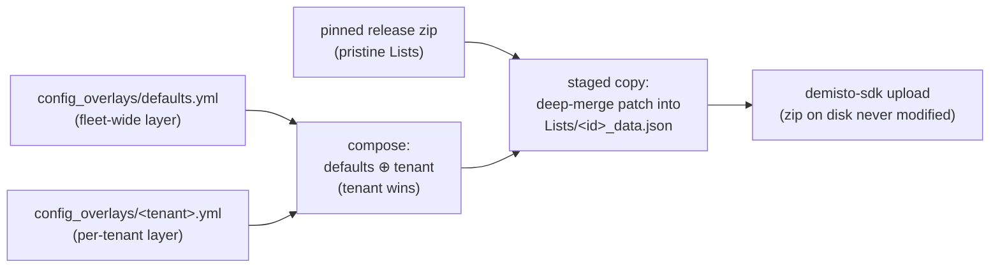

# Config Overlay lifecycle — tuning framework Lists, end to end

How the fleet tunes framework config List values (shadow flips, thresholds,
routing) per tenant or fleet-wide, without forking packs or touching pins.
A tenant's deployed List is always **`pinned ⊕ Config Overlay`**: the pristine
List the pinned pack ships, deep-merged with a fleet-owned sparse patch.

These Lists are **not customer extension points**: console hand-edits and
customer-repo writes to them are ephemeral by design — the next converge
restores `pinned ⊕ Config Overlay`. If a value should stick, it lands here.

Companion docs: the [runbook](runbook.md) ("Flip an action live for a
tenant") is the condensed checklist; [custom-pack-lifecycle.md](custom-pack-lifecycle.md)
and [customer-pack-lifecycle.md](customer-pack-lifecycle.md) cover pack
content itself.



## Step 0 — Register the List id (once per List)

Only List ids registered in `fleet/defaults.yml › config_overlay_lists` may
be patched — `config_overlay_lint.py` rejects anything else, so a typo'd id
fails the PR instead of silently patching nothing.

| File | Change |
|---|---|
| `fleet/defaults.yml` | add the List id under `config_overlay_lists:` (skip if already registered) |

The four framework Lists the template registers
(`SOCFrameworkActions_V3`, `SOCExecutionList_V3`, `SOCOptimizationConfig_V3`,
`SOCProductCategoryMap_V3`) are the usual tuning surface; extend the
registry when the framework adds tunable Lists.

## Step 1 — Author the patch

Two layers compose, and an absent file is simply an empty layer:

| File | Scope |
|---|---|
| `fleet/config_overlays/defaults.yml` | fleet-wide — every tenant |
| `fleet/config_overlays/<tenant>.yml` | one tenant — **wins on conflicts** |

Each file is a mapping of List id → sparse patch. Patch **only what you are
changing** — the pinned artifact supplies every key the patch does not name:

```yaml
# fleet/config_overlays/prodcustomer01.yml — flip one action live
SOCFrameworkActions_V3:
  isolate_host:
    shadow_mode: false
```

Merge semantics (`deep_merge`, `over` wins): where both sides hold a mapping
for the same key, they merge recursively; **any other value — scalar, list,
or a type change — is replaced wholesale**. Lists are never element-merged:
a patch that names a list means "this exact list".

Structural rules the lint enforces on every PR (and `check.sh` at commit):
every List id registered (Step 0), every file a mapping of id → mapping
patch, and every `<tenant>.yml` matching an existing Tenant Profile — a
layer left behind by a renamed tenant looks live but is never read, so it
fails structurally instead.

## Step 2 — Preview offline

```bash
python scripts/config_overlay_lint.py     # structural gate (also in check.sh)
python scripts/resolve.py prodcustomer01  # shows the composed overlay per List
python scripts/deploy_tenant.py prodcustomer01 \
    --installed fixtures/installed_state.sample.yml   # which Lists converge will patch
```

`resolve.py` prints the composed `defaults ⊕ tenant` patch; `deploy_tenant.py`
shows the `CONFIG OVERLAY` section of the plan — the List ids the converge
will merge and upload.

## Step 3 — PR, merge, converge

| File | Change |
|---|---|
| `fleet/config_overlays/defaults.yml` and/or `<tenant>.yml` | the patch (Step 1) |

No pins change. **PR gate:** ring-gate runs the pytest suite and the overlay
lint (soak/no-skip do not apply — nothing is promoting).

**On merge:** `fleet/config_overlays/**` is the third converge trigger. The
plan job maps the changed layer to affected tenants — the `defaults` layer
affects **every ring**; a per-tenant layer affects **exactly that tenant** —
and fans out one job per tenant. Each job then:

1. fetches the tenant's pinned release zips (pristine, as always);
2. extracts each into a staging dir and deep-merges the composed patch into
   whichever staged pack carries each List — the List→pack mapping is
   **discovered** (`Lists/<id>/<id>_data.json`, or the single-file
   `Lists/<id>.json` `data:` form), not declared;
3. uploads with `demisto-sdk`. The merge is **ephemeral**: the fetched zip
   on disk is never modified, so the deployed List stays a pure function of
   `(pin, Config Overlay)`.

**Incomplete Converge:** a composed List id that *no* deployed pack carries
cannot be applied — the run records a `config-overlay:<id>` failure row
rather than silently skipping it. Usual causes: the List moved packs on a
version bump, or the registry names an id the tenant's composition never
ships. Fix the id (or the composition) and re-run.

## Step 4 — Verify and watch for drift

The List-content half of the drift check compares each tenant's **live**
List content against `pinned ⊕ Config Overlay`:

```bash
python scripts/drift_check.py --state fixtures/installed_state.sample.yml \
    --lists-state fixtures/lists_state.sample.yml \
    --pinned-lists fixtures/pinned_lists.sample.yml
```

- **LIST DRIFT** — live content differs from expected: someone hand-edited
  the List in the console. Re-converge to reset it; if the value should
  stick, land it as an overlay change instead (this doc, from Step 1).
- **LIST MISSING** — a fleet-owned List absent on the tenant.
- **Unmanaged Lists** (neither pinned nor overlaid) are reported, never
  deleted.

## Rollback

`git revert` the overlay commit — the next converge redeploys the pinned
value (or the previous patch). Nothing else to undo: no pins moved, no
release artifacts were produced.

## How overlays interact with pins

- **Overlays survive pin bumps.** The patch applies to whatever version the
  ring pins today; promote a pack dev → qa → prod and each ring's converge
  re-merges the same patch onto the new pristine List.
- **Overlays are not ring-scoped.** Layers are fleet-wide or per-tenant;
  ring behavior emerges from which tenants a layer touches. A "qa-only"
  tuning is a patch on the qa tenants' layers.
- **Overlays ride `local` too:** a dev tenant deploying an MSSP pack from
  source gets the same staged-merge treatment.

## Quick reference — which file changes when

| File | Step 0 (register) | Step 1/3 (patch) |
|---|---|---|
| `fleet/defaults.yml › config_overlay_lists` | ✏️ add List id | — |
| `fleet/config_overlays/defaults.yml` | — | ✏️ fleet-wide patch |
| `fleet/config_overlays/<tenant>.yml` | — | ✏️ per-tenant patch |
