# Custom pack lifecycle — tenant-first, end to end

The full path for MSSP-authored content built **in the dev tenant's console**
and shipped to customers as a versioned pack: author → package → release →
qa → prod. This is the tenant-first model: the dev tenant keeps the content
as raw user content and **never installs the packaged pack** (uploading it
over the console originals risks ID collisions); qa is the first ring that
actually runs the artifact.

Worked example below uses `MsspAlertTriage`. See the
[runbook](runbook.md) for the condensed checklist and the
[README](../README.md) for the underlying model (composition ⊕ pins,
promotion, convergence).

```mermaid
flowchart LR
    A["Step 0 — author<br/>in the dev tenant<br/>(console, raw content)"] --> B["Step 1 — pack PR<br/>Packs/&lt;id&gt;/ + catalog<br/>+ inert dev pin"]
    B -->|merge| R["release.yml publishes<br/>&lt;id&gt;-v1.0.0.zip"]
    R --> C["Step 2 — promote PR<br/>qa.yml pin +<br/>qa tenant extras"]
    C -->|merge| Q["converge qa<br/>(first real deployment)"]
    Q --> D["Step 3 — QA testing<br/>(qa soak clock runs)"]
    D --> E["Step 4 — promote PR<br/>prod.yml pin +<br/>prod composition"]
    E -->|"soak + window +<br/>review + approval"| P["converge prod"]
```



## Step 0 — Author in the dev tenant

Build the content (scripts, playbooks, layouts) in the dev tenant's console
as normal user content. **No repo files change.** The dev tenant keeps this
raw form permanently — the drift job never sees it (unpacked custom content
is not a pack), and that divergence is by design.

## Step 1 — Pack PR: source + catalog + dev pin

Pull the content down and package it:

```bash
demisto-sdk download -o Packs/MsspAlertTriage -i "<item names>"  # dev tenant creds
python scripts/mssp_catalog.py --write
```

Set up `Packs/MsspAlertTriage/pack_metadata.json` — the pack `id` and
`currentVersion: 1.0.0`. The id must **not** carry a registered customer
prefix (`namespace_lint.py` rejects e.g. `acme-*` on MSSP-authored packs).
Then pin it in dev. One PR, three changes:

| File | Change |
|---|---|
| `Packs/MsspAlertTriage/**` | new — the pulled-down pack source |
| `mssp_pack_catalog.json` | regenerated — id, version, release-zip URL |
| `fleet/pins/dev.yml` | add `MsspAlertTriage: 1.0.0` |

The dev pin is **inert**: converge iterates each tenant's *composition* and
looks pins up per composed pack, and nothing in dev composes this pack (not
`defaults.yml › base`, no subscribed group, no dev tenant `extras:`). That is
why all three changes are safe in a single PR — nothing tries to fetch the
zip before it exists. The pin exists purely as ring-gate's entry turnstile:
a version can only reach `qa.yml` by promotion from `dev.yml` (no-skip).

- **PR gate (ring-gate):** pytest, resolve for all rings, namespace lint,
  catalog-sync check. The dev pin passes freely — dev is a head ring.
- **On merge:** `release.yml` tags `MsspAlertTriage-v1.0.0` and publishes
  `MsspAlertTriage-v1.0.0.zip` on this repo's Releases (the URL the catalog
  already points at). Converge runs for the dev ring (its pin file changed)
  but deploys nothing new.

> **Iterating repo-first instead?** The `local` pin sentinel exists for that
> flow (every merge to `Packs/<id>/` converges dev from source), but it is
> irrelevant tenant-first — and ring-gate keeps `local` out of qa/prod
> regardless.

## Step 2 — Promote to qa + compose on the qa tenant

```bash
python scripts/promote.py --pack MsspAlertTriage --to qa   # or the promote workflow
```

| File | Change |
|---|---|
| `fleet/pins/qa.yml` | gains `MsspAlertTriage: 1.0.0` (written by promote) |
| `fleet/tenants/qacanary01.yml` | add `MsspAlertTriage` under `extras:` — same PR |

Compose via tenant `extras:` at this stage, not a group: a group subscribed
by tenants in other rings would demand pins in those rings too. Ring-scoped
composition keeps the rollout clean.

- **PR gate:** no-skip ✓ (1.0.0 is in `dev.yml`); soak **exempt** ✓ —
  MSSP-authored packs promoting out of the head ring skip `min_soak_days`
  (dev never runs the artifact, so dev soak is a dead timer; third-party
  packs still soak).
- **On merge:** converge qa — `catalog.py` resolves the id from the
  committed `mssp_pack_catalog.json` (no network), fetches the release zip,
  the host guard verifies the qa tenant's creds actually point at that
  tenant, and `demisto-sdk upload` installs it. **First tenant to ever run
  the packaged artifact.**

## Step 3 — QA testing and sign-off

No repo files change. Test on the qa tenant while the qa soak clock runs in
git history: prod requires the pin to have sat in `qa.yml` for at least
`min_soak_days` (`fleet/policies.yml`, prod ring — applies to **all** packs,
MSSP-authored included, because qa actually runs them).

Found a bug? That is a `1.0.1`: repeat Step 1's file set (bump
`currentVersion`, `mssp_catalog.py --write`, bump `fleet/pins/dev.yml`),
merge to publish the new release, re-promote to qa. The soak clock restarts
for the new version.

## Step 4 — Promote to prod + compose on prod tenants

```bash
python scripts/promote.py --pack MsspAlertTriage --to prod
```

| File | Change |
|---|---|
| `fleet/pins/prod.yml` | gains `MsspAlertTriage: 1.0.0` |
| `fleet/tenants/prodcustomer01.yml` (etc.) | add to `extras:` — or promote the composition to a group / `defaults.yml › base` if it is going fleet-wide |

Going into `base` means *every* tenant composes it — including the
mssp-ring parent — so `fleet/pins/mssp.yml` needs the pin in the same PR.

- **PR gate:** no-skip ✓ (in `qa.yml`); qa soak satisfied (≥ prod
  `min_soak_days`); the merge must land inside a prod change window; plus the
  human layer — CODEOWNERS review on `fleet/pins/prod.yml`.
- **On merge:** converge prod runs under the `fleet-prod` GitHub Environment
  (required reviewers approve; prod-scoped secrets) and uploads **the same
  zip qa validated** — the artifact never changes between rings, only the
  pin advances.

## Quick reference — which file changes when

| File | Step 1 (package) | Step 2 (→ qa) | Step 4 (→ prod) |
|---|---|---|---|
| `Packs/<id>/**` | ✏️ new / bump | — | — |
| `mssp_pack_catalog.json` | ✏️ regenerate | — | — |
| `fleet/pins/dev.yml` | ✏️ add pin | — | — |
| `fleet/pins/qa.yml` | — | ✏️ promote | — |
| `fleet/tenants/<qa>.yml` | — | ✏️ compose | — |
| `fleet/pins/prod.yml` | — | — | ✏️ promote |
| `fleet/tenants/<prod>.yml` / group / base | — | — | ✏️ compose |

## Rollback and removal

- **Rollback** at any ring: `git revert` the pin/composition PR — the next
  converge uploads the older zip over the newer install.
- **Removal** later is composition-first: delete the pack id from wherever it
  is composed, merge, and converge orphan-deletes it (MSSP-authored ids are
  inside the bounded deletable set). Clean up the now-unused pins afterwards
  — never delete the pin first (a composed-but-unpinned pack is a hard
  resolve error). See the runbook's "Remove a pack from a tenant/ring".
