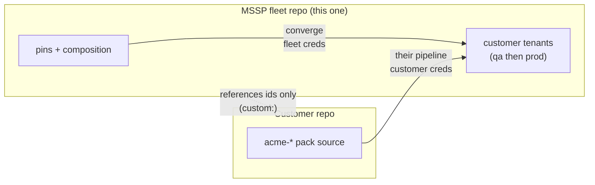

# Customer-owned pack lifecycle — the second writer, end to end

How packs authored in a **customer's own repo** reach that customer's qa and
prod tenants, and what this fleet repo does (and deliberately does not do)
along the way.

The short answer first: **the fleet never installs, versions, promotes, or
deletes customer packs.** The customer repo is the second independent writer
to the same tenants, deploying with its own credentials. This repo only
*references* customer content for visibility and *protects* it structurally.
The qa → prod motion for customer packs happens entirely in the customer's
pipeline — mirroring the same discipline, but against their tenants with
their secrets.

Companion docs: [custom-pack-lifecycle.md](custom-pack-lifecycle.md) covers
the MSSP-authored equivalent (which *does* ride this repo's rings);
the [README](../README.md) describes the namespace contract.

## The contract in one screen

Two writers touch each customer tenant, kept apart by a purely structural
**namespace prefix** — no ID inventory is ever exchanged between the repos:

| | MSSP fleet (this repo) | Customer repo |
|---|---|---|
| Content | base + extras, pinned per ring | customer packs, prefixed (e.g. `acme-`) |
| Credentials | per-tenant CI secrets here | the customer's own |
| Promotion | pins + ring-gate (dev → qa → prod) | the customer's pipeline |
| Prefix rule | **forbidden** on MSSP ids (`namespace_lint.py`) | **required** on every id (their CI) |

Because the partition is structural, the fleet can converge, drift-check,
and orphan-delete aggressively on its own content while remaining provably
unable to touch the customer's.



## Step 0 — One-time setup in this repo

| File | Change |
|---|---|
| `fleet/defaults.yml` | add the customer's prefix under `customer_namespaces:` (e.g. `- acme-`) |
| `fleet/tenants/<tenant>.yml` | optionally declare `customer_namespace: acme-` on their tenant(s) |

Registering the prefix is what arms the protections: `namespace_lint.py`
fails any PR that gives an MSSP-authored pack that prefix, drift reports
matching installed content as customer-owned instead of UNMANAGED, and the
orphan-delete path in `deploy_tenant.py` refuses to ever touch it.

The customer's CI enforces the mirror rule — every id they deploy carries
their prefix. That check lives in *their* repo; this repo never needs to
know their pack list.

## Step 1 — Customer authors and ships to their qa tenant

Everything here happens in the **customer's repo**, with customer-scoped
credentials. No files change in this repo.

The recommended shape mirrors the fleet's own discipline:

1. Author pack source under their repo (ids prefixed: `acme-detections`).
2. Deploy first to a **nonprod tenant of theirs** — the fleet can manage
   that tenant's MSSP content in a nonprod ring while the customer uses it
   as their qa target; the two chains are independent, and the shared
   namespace rules keep the writers from colliding on it.
3. Validate there, then deploy the same artifact to their prod tenant.

How gated that pipeline is (reviews, soak, change windows) is the
customer's policy, in their repo. If the MSSP operates the customer repo
*on the customer's behalf* (a managed service), it stays exactly this —
a separate repo and pipeline with customer-scoped secrets — never a merge
into the fleet's pins.

## Step 2 — (Optional) Reference the packs in this repo

If it helps operations to see customer content in fleet tooling, reference
the ids on the tenant profile — entries are dicts, and `owner` defaults to
`customer`:

```yaml
# fleet/tenants/prodcustomer01.yml
custom:
  - id: acme-detections
    owner: customer
```

| File | Change |
|---|---|
| `fleet/tenants/<tenant>.yml` | add ids under `custom:` |

`namespace_lint.py` requires every referenced id to carry a registered
prefix. The reference is **informational only**:

- `resolve.py <tenant>` lists it under `CUSTOM (customer-owned · referenced
  only)` — it never enters the effective install set.
- `deploy_tenant.py` prints it as `# custom (owner=customer) … — not managed
  here` and never resolves, fetches, or uploads it.
- `drift_check.py` never compares its version — customer packs are not
  drift-checked, by design (the fleet has no idea what version is current,
  and should not).

## Step 3 — What the fleet does when it meets customer content live

During converge and drift against a live tenant, customer-prefixed packs in
the installed state are:

- **never deleted** — the orphan-delete bounded set is `upstream catalog ∪
  MSSP-authored ids`; registered customer prefixes are excluded outright;
- **never overwritten** — the fleet only uploads packs it composes, and
  customer-prefixed ids can never enter composition (lint blocks them);
- **reported, not judged** — drift labels them customer-owned rather than
  UNMANAGED, so fleet operators do not chase them as anomalies.

## Why the fleet cannot promote customer packs (by design)

It is tempting to want `acme-detections` in `fleet/pins/qa.yml`. The repo
refuses on several reinforcing grounds:

- `namespace_lint.py` fails the PR: pinned ids are treated as MSSP-authored,
  and MSSP-authored ids may not carry a customer prefix.
- Neither catalog can resolve the id — it is not in
  `mssp_pack_catalog.json` and not in the upstream catalog, so there is no
  zip to fetch (a pin with no artifact is a `ResolveError`, never "latest").
- The credential seam is per-writer: fleet CI holds fleet secrets; deploying
  customer content under fleet credentials would collapse the ownership
  boundary the support model depends on.

## Escape hatch — transferring ownership to the MSSP

If a customer pack should become fleet-managed (the customer hands it over,
or it graduates into the MSSP's standard offering), that is an **ownership
transfer**, not a reference:

1. Re-id the pack **without** the customer prefix (the prefix means "not
   ours" — it cannot stay).
2. Bring the source into `Packs/<NewId>/` in this repo (or the MSSP pack
   repo) and release it via `mssp_catalog.py --write` + `release.yml`.
3. From there it follows [custom-pack-lifecycle.md](custom-pack-lifecycle.md)
   exactly: inert dev pin → qa (soak-exempt) → prod (soak + window +
   approval).
4. The customer removes the old prefixed pack from their pipeline; the
   installed remnant on the tenant shows in drift as customer-owned until
   they delete it from their side.

## Quick reference — which repo does what

| Action | This repo | Customer repo |
|---|---|---|
| Register the namespace | `defaults.yml › customer_namespaces` | — |
| Author / version packs | — | ✏️ their source, their ids |
| Deploy to customer qa tenant | — | ✏️ their pipeline, their creds |
| Promote to customer prod | — | ✏️ their pipeline |
| Reference for visibility | `tenants/<t>.yml › custom:` | — |
| Protect from deletion | automatic (registered prefix) | — |
| Drift-check the pack | never | theirs to implement |
